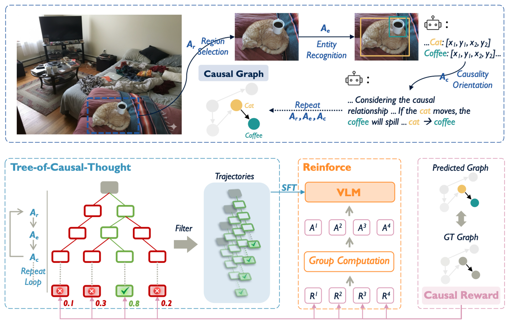

<p align="center">
  
</p>

<div id="top" align="center">

**CauSight**: *Learning to Supersense for **Visual Causal Discovery***

>[[Dataset]](https://huggingface.co/datasets/OpenCausaLab/VCG-32K) [[Model]](https://huggingface.co/OpenCausaLab/CauSight) [[Paper]](https://arxiv.org/abs/2512.01827)

</div>

## 🔥 Highlights

We introduce the task of **visual causal discovery**. It requires models to infer cause-and-effect relations among visual entities across diverse scenarios instead of merely perceiving their presence. we first construct the Visual Causal Graph dataset (**VCG-32K**), a large-scale collection of over 32,000 images annotated with entity-level causal graphs, and further develop **CauSight**, a novel vision-language model to perform visual causal discovery through causally aware reasoning. Our training recipe integrates three components: (1) training data curation from VCG-32K, (2) Tree-of-Causal-Thought (ToCT) for synthesizing reasoning trajectories, and (3) reinforcement learning with a designed causal reward to refine the reasoning policy. Experiments show that CauSight outperforms GPT-4.1 on visual causal discovery, achieving over a **threefold performance boost**.

<p align="center">
  
</p>

## 🔧 Getting Started

### 1. Clone the Repository

```bash
git clone https://github.com/OpenCausaLab/CauSight.git
cd CauSight
```

### 2. Set Up the Environment

We recommend using **conda**:

```bash
conda create -n causight python=3.10
conda activate causight

pip install -r requirements.txt
pip install -e .
```

### 3. Download the Dataset (VCG-32K)

```bash
mkdir -p VCG-32K
pip install huggingface_hub

hf login
hf download OpenCausaLab/VCG-32K \
    --repo-type dataset \
    --local-dir ./VCG-32K
```

```bash
tar -xzf ./VCG-32K/COCO/images.tar.gz -C ./VCG-32K/COCO
tar -xzf ./VCG-32K/365/images.tar.gz -C ./VCG-32K/365
```

### 4. Download the CauSight Model

```bash
mkdir -p model
huggingface-cli download OpenCausaLab/CauSight \
    --repo-type model \
    --local-dir ./model
```

### 5. Evaluation

Start the model server, then run inference:

```bash
bash model_server.sh
python run_inference.py
```

### 6. Tree-of-Causal-Thought 

If you want to make your own SFT data with Tree-of-Causal-Thought, run:

```bash
bash model_server.sh
python run.py
```

## Citation
```BibTeX
@article{zhang2025causight,
  title={CauSight: Learning to Supersense for Visual Causal Discovery},
  author={Zhang, Yize and Chen, Meiqi and Chen, Sirui and Peng, Bo and Zhang, Yanxi and Li, Tianyu and Lu, Chaochao},
  journal={arXiv preprint arXiv:2512.01827},
  year={2025}
}
```
